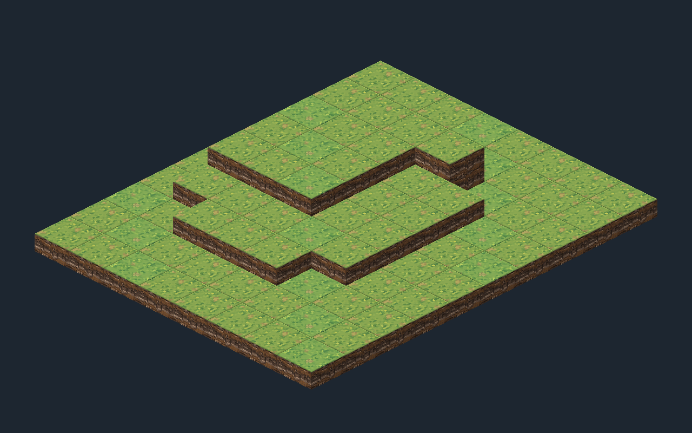

# Grid System

이 문서는 Grid, Pathfinding, LOS, Map Generation, Tilemap Presentation 작업의 기준이다.

## Logical Coordinate System

논리 Grid는 2차원이며 `GridPosition(X, Z)`로 Cell을 식별한다.

- `X`: 열
- `Z`: 행
- 좌표 범위: `X = 0..Width-1`, `Z = 0..Depth-1`

`GridPosition`은 Height, World Position, Unity 좌표를 포함하지 않는다.

## Height Model

각 `CellState`가 게임 규칙용 정수 Height를 가진다.

- `0`: Low Ground
- `1`: Mid Ground
- `2`: High Ground

Height는 Unity World Y가 아니다. 화면에서의 높이 간격은 Presentation 계층이 결정한다. 범위를 벗어난 값은 clamp하지 않고 명확하게 거절한다.

## Surface Model

MVP는 **One Surface Per X/Z** 모델을 사용한다. 하나의 `GridPosition`에는 하나의 `CellState`만 존재한다.

같은 X/Z의 다리와 지면, 다층 건물, 지하층, 겹치는 여러 Walkable Surface는 지원하지 않는다.

## Neighbor Model

공간적 인접 Cell은 다음 4방향으로 한정한다.

1. `+X`
2. `-X`
3. `+Z`
4. `-Z`

Diagonal은 지원하지 않는다. 중앙 Cell은 최대 4개, Edge는 최대 3개, Corner는 최대 2개의 인접 Cell을 가진다. 인접 조회는 Height, Walkable, Occupancy를 검사하지 않는다.

## Height Traversal Rule

기본 이동 가능 여부는 다음 규칙을 사용한다.

`abs(from.Height - to.Height) <= 1`

Height 차이가 0 또는 1이면 이동 가능하고, 차이가 2이면 이동할 수 없다. 현재 MVP에서 평지 이동과 Height 1 차이 이동은 모두 거리 1이며 추가 Movement Cost는 없다. `GridTraversal`이 인접한 두 Cell의 이 규칙을 판정하고, `ReachabilityFinder`의 BFS가 이 판정을 소비한다.

## Pass-through and Stop-at

`GridTraversal` 판정은 중간 경로로 통과할 수 있는지와 최종 위치로 정지할 수 있는지를 분리한다.

- 빈 Walkable Cell: 통과 가능, 정지 가능
- 아군 Unit 점유 Cell: 통과 가능, 정지 불가
- 적군 Unit 점유 Cell: 통과 불가, 정지 불가
- `UnitRegistry`에서 해석할 수 없는 Entity 점유 Cell: 안전하게 Blocking으로 처리
- Mover 자신이 목적지를 점유한 호출: 유효하지 않은 상태로 보고 통과를 거절

`CanPassThrough` 판정은 Bounds, 4방향 인접, 목적지 Walkable, Height 차이, Occupancy와 Team을 조합한다. `CanStopAt`은 단일 Cell을 판정하므로 Height edge를 검사하지 않고 Bounds, Walkable, 빈 Occupancy만 확인한다.

## Reachability BFS

`ReachabilityFinder.FindReachableCells(mover, maxDistance)`는 배치된 Unit의 현재 위치에서 거리 안에 이동을 끝낼 수 있는 Cell들을 반환한다. 시작 Cell은 제외하고, 거리 0은 빈 결과다. null Mover, 음수 거리, 미배치 또는 해당 Grid 밖에 배치된 Mover는 명시적으로 예외를 발생시킨다. 결과 순서는 API 계약이 아니다.

모든 Traversal Edge Cost는 평지·오르막·내리막 모두 1이다. BFS는 Queue와 최초 방문 거리 Dictionary를 사용하고, 탐색용 Visited와 최종 Reachable 결과를 분리한다.

- 공간 후보는 `GetOrthogonalNeighbors`, 탐색 허용은 `CanPassThrough`, 목적지 포함 여부는 `CanStopAt`으로 결정한다. BFS가 Height/Walkable/Team/Occupancy 규칙을 직접 재구현하지 않는다.
- 아군 Cell은 탐색 가능하지만 목적지가 아니며, 뒤쪽 빈 Cell은 거리 안이면 목적지가 될 수 있다. 적군/Unknown Occupancy는 해당 경로의 탐색을 차단한다.
- 계산은 순수 조회이며 Unit 위치, Terrain, Occupancy, Registry를 변경하지 않는다. ReachabilityFinder는 predecessor를 저장하지 않으며 경로 복원은 별도 `PathFinder`의 책임이다.

## Path Reconstruction

`PathFinder.TryFindPath(mover, target, maxDistance, out path)`는 특정 Target까지 비용 1의 BFS 최단 경로를 계산한다. 최초 발견 시 `cameFrom[next] = current`를 기록하고, Target에서 Start까지 역추적한 뒤 순서를 뒤집는다. ReachabilityFinder를 호출하거나 공용 탐색 엔진으로 합치지 않는다.

- 성공 Path는 실제 밟을 Step 순서이며 **Start 제외 / Target 포함**이다. 동일 길이의 여러 최단 경로 중 선택 순서는 보장하지 않는다.
- `Start == Target`은 `CanStopAt(start)` 검사 없이 빈 Path로 성공한다. 그 외 Target은 `CanStopAt`을 만족해야 하며, 거리 초과·Grid 밖 Target·경로 없음은 `false`와 빈 Path를 반환한다.
- 공간 후보는 `GetOrthogonalNeighbors`, 각 Step은 `CanPassThrough`로 판정한다. Height/Walkable/Team/Occupancy 규칙을 직접 검사하지 않는다. 아군은 중간 Step이 될 수 있지만, 아군·적군·Unknown 점유 Target은 불가하다.
- 모든 Edge Cost는 평지·오르막·내리막 모두 1이며 `maxDistance`는 최대 Step 수다. null Mover, 음수 거리, 미배치 또는 Grid 밖 Mover는 Reachability와 같은 예외 정책을 사용한다.
- Path Query는 Unit/Terrain/Occupancy/Registry 상태를 변경하지 않는다. 검증된 이동의 상태 변경은 별도 `UnitMovementService`의 책임이다.

## Unit Movement Domain

`UnitMovementService.TryMove(mover, target, maxDistance, out path)`는 이미 배치된 Unit의 이동을 검증하고 최종 위치로 적용한다. 다음 세 값의 일치를 mutation 전에 확인하며, 성공 후에도 유지한다.

`UnitState.Position == Occupancy.TryGetPosition(Unit.Id)`이고 `Occupancy.TryGetOccupant(Unit.Position) == Unit.Id`.

- 입력과 양방향 점유 일관성 확인 → `PathFinder` 경로 검증 → `GridOccupancy.TryRelocate(id, start, target)` → `UnitState` internal 위치 갱신 순서다. 서비스는 Height/Walkable/Team/BFS 규칙을 재구현하지 않는다.
- `TryRelocate`는 유효 ID, 출발점의 정방향·역방향 매핑, 빈 목적지, 서로 다른 좌표를 모두 검사한 뒤 두 맵을 변경한다. 거절 시 두 맵을 보존하며 Bounds/Traversal은 판단하지 않는다. 서비스에서 Release + Occupy를 따로 호출하지 않는다.
- Unit 위치에는 public setter가 없다. `MoveFromTo(expectedFrom, target)`은 예상 출발점을 확인한다. 현재 Domain은 main-thread 동기 실행이고 조회·재배치 중 외부 콜백이 없으므로 사전 검증된 Unit 갱신은 결정적으로 성공한다.
- 성공은 **Start → Target 한 번의 final relocation**이다. 중간 Cell에 Mover를 등록하지 않으므로 `S → Ally → T` 경로에서도 아군 위치와 점유는 그대로 남는다.
- 반환 Path는 Start 제외/Target 포함의 route description이다. 반환 시 Domain은 이미 Target에 있으며, 중간 Cell은 현재 Occupancy state가 아니다. 향후 Presentation은 이 경로를 애니메이션에 사용할 수 있다.
- 도달 불가·점유 Target·거리 부족·재배치 거절은 `false`와 빈 Path를 반환하며 Unit/Occupancy/Terrain/Registry를 보존한다. `Start == Target`은 일관성 검증 후 빈 Path로 성공하는 no-op이며 재배치하지 않는다.
- null Mover·음수 거리·미배치는 명시적 입력 예외다. 기존 Unit/Occupancy 불일치는 `InvalidOperationException`으로 드러내며 조용히 복구하지 않는다. Grid 밖 Mover 검증은 PathFinder에 위임한다.

Trap/Hazard/OnEnter/기회 공격/이동 중단이 필요해지면 별도 Movement Execution 또는 Combat Action 계층에서 경로를 순서대로 소비할 수 있다. 이번 단계에는 traversal event나 interruption framework를 구현하지 않는다.

## Tilemap Mapping

Unity 2D Presentation은 Isometric Z as Y Tilemap을 사용한다. 변환은 별도 Presentation 어셈블리의 `GridPresentationMapper`가 담당하며 Domain은 Unity 타입을 참조하지 않는다.

| Logical value | Tilemap value |
| --- | --- |
| `GridPosition.X` | X |
| `GridPosition.Z` | Y |
| `CellState.Height` | Z |

예를 들어 `GridPosition(3, 5)`, Height `2`는 Presentation에서 `Vector3Int(3, 5, 2)`에 대응한다. 이 변환은 Presentation 규칙이며 Grid Domain에는 포함하지 않는다.

## Tilemap Responsibility

`BattlePrototype.unity`의 현재 구조는 다음과 같다.

```text
BattlePrototypeRoot
├─ BattleGrid (Grid: Isometric Z as Y, IsometricGridPresenter)
│  ├─ TerrainTopTilemap
│  ├─ TerrainSideTilemap
│  └─ OverlayTilemap
├─ PresentationBootstrap
└─ Main Camera
```

- `TerrainTopTilemap`: 각 Domain Cell의 Height에 지면 윗면 한 장
- `TerrainSideTilemap`: 고정 카메라에서 보이는 -X(좌), -Z(우) 이웃보다 높은 부분의 절벽 면. 높이 차이만큼 32px 측면을 쌓고, 맵 밖은 Height -1로 간주해 외곽 바닥 단을 표현한다. 이 -1은 표현용이며 Domain Cell에 저장하지 않는다.
- `OverlayTilemap`: 현재 비어 있음. 이동/공격 범위·선택·Path Preview 등 기능은 후속 작업이다.

Tilemap은 논리 상태를 표현하며 이동 가능 여부나 게임 규칙을 결정하지 않는다.

`IsometricGridPresenter.Render`는 기존 Top/Side 타일을 지우고 GridState를 읽어 다시 배치한다. `BattlePrototypeBootstrap`은 10×8 고정 Demo GridState(Height 0/1/2)를 조립한다. 저장된 Scene에도 타일이 있어 편집 중 바로 보이며, Play 시작 시 같은 Domain 샘플로 재렌더한다. Unit·Input·이동 실행은 포함하지 않는다.

실제 Unity URP 렌더 캡처(2026-09-03):



Grid Cell Size는 `(1, 0.5, 1)`, Tile Anchor는 `(0,0,0)`이며 Height 1은 화면 Y 0.25(32px)에 대응한다. Top/Side는 같은 sorting order의 Individual 모드로 서로 섞여 정렬되고, URP `Renderer2D`의 Custom Axis는 `(0,1,-0.26)`이다. 이 설정은 [Unity의 Isometric Z as Y 정렬 기준](https://unity.com/blog/engine-platform/isometric-2d-environments-with-tilemap)을 따른다. 카메라는 Orthographic, size 3.125, 위치 `(0.5,2,-10)`, 중립 청회색 배경이다.

## Tile Art Baseline

- 형태: Isometric Diamond
- 종횡비: 2:1
- Prototype source size: 128×64 px
- 기본 PPU: 128

이 값은 Art/Presentation 기준이며 Grid Domain에 하드코딩하지 않는다.

현재 `Art/Environment/Tiles/Prototype`에는 GrassTop/GrassTopVariation, CliffLeft/CliffRight/CliffBoth의 PNG와 Tile 에셋이 있다. 모두 128×64, Sprite Single, PPU 128, Point, 무압축, mipmap 없음이다. Top pivot은 `(0.5,0.5)`, 측면은 `(0.5,1)`이며 정확한 투명 픽셀 외곽 보존을 위해 Full Rect mesh를 쓴다. URP 2D Unlit Material로 조명 없이 읽히는 임시 아트이며 최종 상용 아트가 아니다.

원본 질감은 built-in imagegen으로 생성했고 `Editor/GridPresentation/ArtSource`에 최종 프롬프트와 함께 보관한다. Editor 메뉴 `ProjectResonance > Prototype > Rebuild Grid Assets and Scene`은 원본에서 PNG/Tile/Scene을 다시 만든다(생성 에셋과 Scene 덮어쓰기 확인 있음). 런타임 텍스처 생성이나 외부 API 호출은 없다.

### Prototype visual verification

1. `Assets/_Project/Scenes/BattlePrototype.unity`를 열고 Game 뷰를 16:10(권장 1280×800)으로 설정한다. Play 시에도 같은 맵이 나타나야 한다.
2. Height 0 평지, 중앙 Height 1 단, Height 2 고지를 구분한다. `(7,3)`의 Height 2와 앞쪽 `(7,2)`의 Height 0 사이에는 2단 측면이 보인다.
3. Top과 어두운 좌/우 측면이 붙어 있고 공중 틈·잘못된 겹침이 없는지 확인한다. Mapper `(3,5), Height 2 → (3,5,2)` 규칙과 Cell의 실제 Height를 구분한다.
4. 픽셀·윤곽선이 흐리지 않은지, Overlay가 비어 있고 Unit/Input/전투 UI가 없는지, Console에 게임 코드 오류가 없는지 확인한다.

Editor 메뉴 `Capture Grid Preview`는 실제 URP 카메라의 1280×800 렌더를 `Logs/BattlePrototype-preview.png`에 저장한다. CLI 실행은 그래픽 장치가 필요하므로 `-nographics`를 사용하지 않는다. 고정 시점·작은 타일 세트만 지원하며 뒷면/회전 카메라/복잡한 cliff autotile, 동적 카메라 맞춤, 최종 아트 품질은 이번 범위가 아니다.

## Source of Truth

`GridState`와 `CellState`는 Terrain/Surface 상태의 Source of Truth다. `GridOccupancy`는 Runtime Entity의 공간 점유 상태를, `UnitState`는 Unit 자체의 Runtime State를 담당한다. `UnitPlacementService`는 최초 배치/제거를, `UnitMovementService`는 배치된 Unit의 검증된 재배치를 조율하여 Unit 위치와 Occupancy를 일치시킨다.

AI, Pathfinding, LOS, Map Generation, Save, Tests는 필요한 Domain 상태를 합성해서 사용한다. Tilemap의 Tile 유무를 조회해 게임 규칙을 판단하지 않으며 Tilemap은 Domain 상태를 읽어 표현한다.

## Terrain State and Runtime Occupancy

`CellState`는 Height와 기본 Walkable 여부 같은 Terrain/Surface 상태만 가진다. `GridOccupancy`는 현재 Grid 공간을 점유하는 Runtime Entity의 별도 Spatial Index다.

Terrain의 `IsWalkable`은 지형 자체가 기본적으로 이동 가능한지를 의미한다. Unit이나 Runtime Obstacle이 Cell을 막더라도 `CellState.IsWalkable`을 변경하지 않는다.

`GridOccupancy`는 `GridPosition`과 일반적인 `EntityId`만 다룬다. Unit, Obstacle, GameObject의 구체 타입은 알지 않는다.

## Runtime Obstacle Identity

향후 게임 규칙 대상인 파괴 가능한 바위, 상자, 얼음벽, HP가 있는 구조물, 일정 시간이 지나면 사라지는 소환물은 `EntityId`와 `GridOccupancy`를 사용할 수 있다. 단순 Decoration에는 `EntityId`가 필요하지 않다.

`GridOccupancy`는 Unit 전용 구조가 아니지만, 현재 단계에서는 `ObstacleState`를 구현하지 않는다.

## Dynamic Walkable Surfaces

Runtime Obstacle과 Walkable Surface 자체를 바꾸는 Terrain Effect는 다르다. 올라갈 수 없는 얼음벽은 Occupancy로 표현할 수 있지만, 솟아오른 대지나 임시 발판처럼 실제 Surface Height를 바꾸는 효과는 Occupancy로 표현하지 않는다.

향후 필요하면 다음 모델을 검토할 수 있다.

`BaseHeight + SurfaceModifier = EffectiveHeight`

현재는 `BaseHeight`, `SurfaceModifier`, `EffectiveHeight`, Terrain Effect System을 구현하지 않으며 `CellState.Height`를 그대로 사용한다.

## Traversal Composition

`CanPassThrough(from, to)`는 다음 조건을 합성한다.

1. Mover가 유효하고 from과 to가 Grid Bounds 내부인가
2. from과 to가 4방향으로 인접했는가
3. 목적지 Terrain의 `CellState.IsWalkable`이 true인가
4. `abs(from.Height - to.Height) <= 1`인가
5. 목적지가 비었거나 Mover가 아닌 아군 Unit으로 점유되었는가

`GetOrthogonalNeighbors`는 계속 순수 공간 인접 조회만 담당한다.

## Explicit Non-Goals

이번 단계에서는 다음을 구현하지 않는다.

- Overlay 기능, cliff autotile, 카메라 조작
- UnitView, ObstacleState, Dynamic Terrain
- Movement Animation/Interruption, A*, Dijkstra, Weighted Movement
- LOS, AP, Skill, Combat, Status, Hazard
- AI, Enemy Intent, Map Generation
- Input, UI, VFX, Save, Mobile 기능

## Future Extension Points

- Runtime `ObstacleState`
- Dynamic Terrain과 Surface Modifier
- 경로를 순서대로 소비하는 traversal effect와 Movement Execution
- Ghost, Flying, Jump, Teleport 등을 조합할 `TraversalContext` 또는 `MovementCapability`
- Wall, Door, Phaseable Wall 등 Cell 사이를 막는 Edge/Link 단위 규칙
- LOS
- Map Generation
- Unit Presentation과 Isometric Overlay
- Height를 왜곡하지 않는 `TraversalLink` 계열 연결: 계단, 점프, 일방통행, 사다리, 특수 이동
